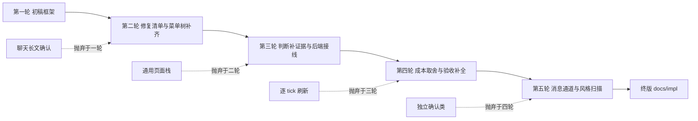

# V4 落实方案迭代记录

工作记录，不进入正式交付。终版正文位于 `docs/impl/2026-07-25-1440-CST-Community-V4前后端落实方案.md`。

## 输入材料

- Imyvm-Design 仓库 `community-main.md` 与 `reviews/implementation-plans/2026-07-19-1619-CST-IMYVM三仓库机制实施计划.md` 的 V4 部分。
- 本仓库菜单框架、聊天互动消息、PendingOperation 与 V4 状态层的代码调查，含对 26.2 字节码的槽位行为核验。

## 第一轮

初稿形成框架：现状判断、菜单树、确认页、互动消息、验收。

- 新增内容：六个 V4 菜单族的初版清单，三类入口分工，确认页统一走 ConfirmMenu。
- 主要批判点：初稿把框架缺陷当作背景一笔带过，没有给修复清单；菜单树缺称号管理、身份设置、发展度与地价三页。
- 被抛弃构想：把确认长文继续留在聊天栏。理由：二十行以上输出在聊天栏溢出即丢信息，与设计文档给可点击消息的定位冲突。

## 第二轮

- 新增内容：框架修复清单七条，逐条附代码位置；菜单树补齐十个页面。
- 主要批判点：现状判断缺代码证据，四类判断中不切实际假设与成本过高方向空缺；后端接线一节没有写 pending 类型扩展与持久化兼容。
- 被抛弃构想：引入通用页面栈重写全部菜单。理由：设计文档要求的是完整 runBack，框架级校验可用更小代价达到同等可靠性。

## 第三轮

- 新增内容：不切实际假设四条，各自落到具体文件行号；后端接线补 PendingOperationType 扩展、字段末尾追加、cycle id 幂等。
- 主要批判点：验收一节只有 build，缺 runServer 走查与身份视图核对；确认页规范没有写等待时限的具体数值。
- 被抛弃构想：菜单内逐 tick 实时刷新地价与发展度。理由：带宽浪费，打开时计算加手动刷新已满足场景。

## 第四轮

- 新增内容：成本过高方向一节，页面栈、独立确认类、逐 tick 刷新三项取舍；验收补 runServer 走查、三身份视图、重启恢复与过期提示。
- 主要批判点：消息规范未写明通道分工，action bar 与聊天的边界含糊；deprecated 转发 `runToggleActionBar` 未列入修复。
- 被抛弃构想：为每个确认场景编写独立菜单类。理由：类膨胀，统一 ConfirmMenu 加 cautions 扩容可覆盖。

## 第五轮

- 新增内容：互动消息规范补通道分工与统一构建器必填参数；修复清单补 CommunityMenuOpener 双实例与死按钮清理。
- 主要批判点：逐句按写作规范扫描，清除过程话语、禁词与全角冒号、括号补充。
- 被抛弃构想：正文保留迭代说明。理由：迭代过程属工作记录，不回灌正文。

## 演进路径

