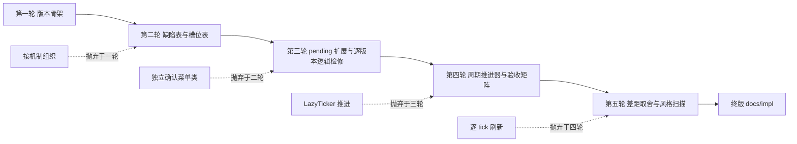

# V4 落地进度与验证文档迭代记录

工作记录，不进入正式交付。终版正文位于 `docs/impl/2026-07-25-1527-CST-Community-V4落地进度与验证.md`，替代 `2026-07-25-1440-CST-Community-V4前后端落实方案.md`。

## 输入材料

- 前一份落实方案及其调查材料。
- 对框架源码的精读：`AbstractMenu.kt`、`AbstractListMenu.kt`、`ConfirmMenu.kt`、`CommunityMenuOpener.kt`、`domain/model/PendingOperation.kt`。
- 对 V4 状态层、服务层、API、配置、持久化、命令、现有菜单、语言文件与测试的精确提取，含六处逻辑缺陷 D1 至 D6 的发现过程。

## 第一轮

初稿形成骨架：总体进度、版本划分、逐版本菜单设计与验证。

- 新增内容：V4.0 至 V4.7 的版本切分，框架修复单列为 V4.0。
- 主要批判点：初稿把机制差距与代码缺陷混在一节，读者无法区分设计文档未实现项与现有代码错误项；菜单设计缺槽位级细节，与"基于现有代码"的要求不符。
- 被抛弃构想：按机制而非按版本组织正文。理由：用户要求逐版本展开，版本是交付与验收的单位。

## 第二轮

- 新增内容：缺陷表 D1 至 D6 独立成表并分配归属版本；菜单设计补槽位表，槽位避让 slot 44、53、0、8 与确认页功能槽。
- 主要批判点：逻辑检修一节停留在原则层，没有逐版本落到具体故障；地皮版本的 pending 类型扩展没有给出枚举值与载荷。
- 被抛弃构想：为每个机制新写确认菜单类。理由：沿用 `ConfirmMenu` 加 cautions 扩容，成本与一致性更优。

## 第三轮

- 新增内容：`PendingOperationType` 扩展三类（值 16 至 18）及有效期；逐版本逻辑检修段落，覆盖幂等、并发双击、回滚顺序、缓存失效。
- 主要批判点：验证步骤缺可观察证据，若干条目无法人工执行；税收福利版本缺周期推进器的设计，D3、D4 修复没有着落。
- 被抛弃构想：用 WorldGeo 内部 LazyTicker 做周期推进。理由：越出跨仓库边界，改用 WorldGeo 时间服务 API 订阅周期。

## 第四轮

- 新增内容：周期推进服务设计，含重启补算与幂等键；验收矩阵对齐实施计划 V4 三条验收并补持久化兼容项。
- 主要批判点：总体进度一节对已完成与未完成的划分含糊；发展度版本的 OP 视图内容没有来源。
- 被抛弃构想：在发展度菜单内做逐 tick 实时刷新。理由：带宽浪费，缓存加统计版本失效即可。

## 第五轮

- 新增内容：机制差距取舍段落，明确 V4 以现有代码机制落地，差距项列为后续决策。
- 主要批判点：逐句按写作规范扫描，清除禁词（此、该、硬编码、再次）、全角冒号与括号补充。
- 被抛弃构想：正文保留与前一份方案的关系说明。理由：过程信息归工作记录，不进正文。

## 演进路径

